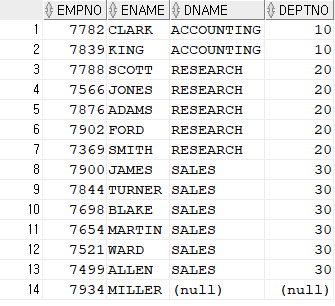

인터뷰 문제 기록
=====
.
- - -
## 목차
1. [자바](#자바)
2. [자바스크립트](#자바스크립트)
	1. [동작원리](#동작원리)
	2. [setTimeout](#setTimeout)
	3. [변수 할당](#변수-할당)
	4. [this](#this)
	5. [관례](#관례)
		1. [전역 선언 방지](#전역-선언-방지)
		2. [이벤트 처리](#이벤트-처리)
	6. [--](#--)
3. [스프링](#스프링)
4. [SQL](#SQL)
	1. [Outer join](#Outer-join)
	2. [--](#--)
5. [알고리즘](#알고리즘)
6. [기타](#기타)

## 자바


##### [목차로 이동](#목차)

## 자바스크립트
### 동작원리
자바스크립트의 런타임에 대해 이해하기 위해서는 먼저 브라우저에 대해 살펴볼 필요가 있다. 브라우저는 크게 두 가지로 나뉜다.

1. 렌더링 엔진[1]
2. 자바스크립트 엔진[2]

이름에서도 알 수 있듯 자바스크립트의 처리를 자바스크립트 엔진이 담당하며, 이중 유명한 것이 구글의 V8엔진[3]이다. V8엔진은 크게 두 부분으로 구성된다.

1. 메모리 힙(Memory Heap)
2. 콜스택(Call Stack)

여기서 의아한 것은 자바스크립트 개발자가 흔히 사용하는 API(ex. `setTimeout`)는 V8엔진이 제공하는 것이 아니란 것이다. 그렇다면 이들은 어디에 구현되어 있을까?

</br>

위에서 보듯, V8엔진 외에 브라우저가 제공하는 웹 API가 있어 DOM, AJAX, `setTimeout` 등을 제공하는 것이다.

한편 자바스크립트는 싱글 스레드 언어, 즉 다시 말해 콜스택[4]이 하나이다. 따라서 한 번에 하나의 일만 처리할 수 있다. 이러한 단일 스레드 기반의 코딩 환경은 장점(ex. 멀티 스레드 환경에서의 `deadlocks` 같은 상황 신경쓸 필요 없음)도 존재하나, 제한점도 존재한다. 바로 특정 코드 실행이 늦어지는, 즉 콜스택 내 수행시간이 긴 함수가 있는 경우다. 예로 브라우저가 응답없음 상태에 빠지는 경우를 들 수 있는데, 이를 블로킹[5]되었다고 한다. 그럼 이때 해결책은 무엇일까? 바로 비동기 콜백(Asynchronous Callbacks)이다. 다시 말하면 나중에 실행될 콜백함수를 이용하는 것인데, 이는 즉시 호출 스택(Call Stack)에 쌓이지 않고 이벤트 큐(Evenet Queue)[6]에서 기다렸다가 호출 스택이 비어 있는 시점에 실행된다. 간단한 예는 아래와 같다.

```javascript
setTimeout(function() {
	console.log("first");
}, 0);
console.log("second");
```

실행 순서는 아래와 같다.

1. `setTimeout`은 호출 스택(Call-Stack)에서 실행된 후 웹 API의 Timer API를 호출한다
2. 웹 API에 의해 `setTimeout`의 콜백 함수는 이벤트 큐(Event Queue)에 밀어 넣어진다
3. `console.log("second")`가 호출 스택에 쌓이고 실행 후 호출 스택이 비었을 때 콜백 함수가 호출 스택으로 온다

- - -
1. 렌더링 엔진
	* 서버로부터 받은 HTML, CSS는 브라우저 렌더링 엔진의 HTML 파서, CSS 파서에 의해 렌더 트리로 결합된다
	* 브라우저는 렌더 트리를 기반으로 웹페이지를 표시한다
2. 자바스크립트 엔진
	* 자바스크립트의 처리, 즉 JS로 작성한 코드를 해석하고 실행하는 인터프리터다
	* 렌더링 엔진의 HTML 파서가 DOM 생성 프로세스를 하던 중 스크립트 태그를 만나면 자바스크립트 엔진에게 제어권한을 넘겨준다
3. V8엔진
	* 크롬과 노드JS에서 사용된다
4. 콜스택
	* 콜스택의 각각은 스택프레임(Stack Frame)이라고 부른다
	* 이는 예외가 발생했을 때 스택 트레이스가 만들어지는 방식이다  
	(스택 트레이스란 예외가 발생했을 때 콜스택의 상태이다)
5. 블로킹
	* 콜스택에 수행할 함수가 있으면 브라우저는 아무 것도 할 수 없다
	* 즉 렌더링을 할 수도 없고, 다른 코드를 수행할 수도 없는 끼어 있는 상황이 된다
	* 이는 부드러운 UI가 표현되기를 원하는 경우 문제가 될 수 있다
6. 이벤트 큐
	* 자바스크립트 런타임 환경의 이벤트 큐는 처리할 메세지 목록 및 실행할 콜백 함수들의 리스트이다
	* DOM 이벤트, HTTP 요청, `setTimeout` 같은 비동기 함수는 웹 API를 호출하며 웹 API는 콜백 함수를 이벤트 큐에 밀어 넣는다
7. 참고문서
	* [자바스크립트는 어떻게 작동하는가: 엔진, 런타임, 콜스택 개관](https://engineering.huiseoul.com/%EC%9E%90%EB%B0%94%EC%8A%A4%ED%81%AC%EB%A6%BD%ED%8A%B8%EB%8A%94-%EC%96%B4%EB%96%BB%EA%B2%8C-%EC%9E%91%EB%8F%99%ED%95%98%EB%8A%94%EA%B0%80-%EC%97%94%EC%A7%84-%EB%9F%B0%ED%83%80%EC%9E%84-%EC%BD%9C%EC%8A%A4%ED%83%9D-%EA%B0%9C%EA%B4%80-ea47917c8442)
	* [자바스크립트는 어떻게 작동하는가: V8엔진의 내부 + 최적화된 코드 작성을 위한 다섯 가지 팁](https://engineering.huiseoul.com/%EC%9E%90%EB%B0%94%EC%8A%A4%ED%81%AC%EB%A6%BD%ED%8A%B8%EB%8A%94-%EC%96%B4%EB%96%BB%EA%B2%8C-%EC%9E%91%EB%8F%99%ED%95%98%EB%8A%94%EA%B0%80-v8-%EC%97%94%EC%A7%84%EC%9D%98-%EB%82%B4%EB%B6%80-%EC%B5%9C%EC%A0%81%ED%99%94%EB%90%9C-%EC%BD%94%EB%93%9C%EB%A5%BC-%EC%9E%91%EC%84%B1%EC%9D%84-%EC%9C%84%ED%95%9C-%EB%8B%A4%EC%84%AF-%EA%B0%80%EC%A7%80-%ED%8C%81-6c6f9832c1d9)
	* [자바스크립트 엔진과 구조](https://velog.io/@imacoolgirlyo/JS-%EC%9E%90%EB%B0%94%EC%8A%A4%ED%81%AC%EB%A6%BD%ED%8A%B8-%EC%97%94%EC%A7%84-Event-Loop-Event-Queue-Call-Stack)

##### [목차로 이동](#목차)

### setTimeout
```javascript
function f() {
	for(var i = 1; i <=3; i++) {
		setTimeout(function() {
			console.log(i);
		}, 1000 * i);
	}
}
f();	// 1초의 간격을 두고 4, 4, 4
```

~~한편 다음의 실행결과는 다르다~~(잘못된 코드).

```javascript
function f() {
	for(var i = 1; i <=3; i++) {
		setTimeout(console.log(i)
		, 1000 * i);
	}
}
f();	// 간격 없이 1, 2, 3
```

먼저 첫 번째 실행 결과에 대해 이해하기 위해 세 가지를 알아야 한다.

1. `setTimeout` 같은 비동기 함수는 웹 API를 호출한다
2. 웹 API는 콜백 함수를 이벤트 큐에 밀어 넣는다
	* 즉, `setTimeout`의 첫 번째 매개변수는 함수의 참조값(실행문 X)이어야 한다
	* 1초의 시간은 콜백 함수가 이벤트 큐에 들어가는 기준이므로 처음에만 존재한다
3. 자바스크립트의 변수 스코프는 함수 블록 단위이다(ECMAScript5 이하)
	* 따라서 익명 함수 내부 선언 변수가 없으므로 이후에 f 함수에서 찾게 되는데 i는 4이다

반면 두 번째 실행 결과는 `setTimeout`의 인자로 함수 실행문이 전달되었으므로 1초 뒤가 아닌 즉시 실행된다고 이해했다. 한편 이와 같은 var 키워드의 비동기 함수 문제는 아래와 같이 해결할 수 있다.

* 방법 1: 함수로 감싸기  
	```javascript
	function f() {
		for(var i = 0; i < 3; i++) {
			((i) => {
				setTimeout(() => {
					console.log(i);
				}, 1000 * i);
			})(i);
		}
	}
	f();
	```
* 방법 2: 클로저 사용  
	```javascript
	function f() {
		for(var i = 0; i < 3; i++) {
			(function(closed_i) {
				setTimeout(() => {
					console.log(closed_i);
				}, 1000 * closed_i);
			})(i);
		}
	}
	f();
	```
* 방법 3: let 키워드 사용  
	```javascript
	function f() {
		for(let i = 0; i < 3; i++) {
			setTimeout(() => {
				console.log(i);
			}, 1000 * i);
		}
	}
	f();
	```
* 방법 4: `forEach()` 사용  
	```javascript
	[0, 1, 2].forEach(function(i) {	// 함수 내부에서 클로저 생성
		setTimeout(function() {
			console.log(i);
		}, 1000 * i);
	});
	```

- - -
1. `setTimeout`
	* [스케줄링: `setTimeout`과 `setInterval`](https://ko.javascript.info/settimeout-setinterval)
2. Scope
	* [Scope](https://poiemaweb.com/js-scope)
	* [스코프와 클로저](https://medium.com/@khwsc1/%EB%B2%88%EC%97%AD-%EC%9E%90%EB%B0%94%EC%8A%A4%ED%81%AC%EB%A6%BD%ED%8A%B8-%EC%8A%A4%EC%BD%94%ED%94%84%EC%99%80-%ED%81%B4%EB%A1%9C%EC%A0%80-javascript-scope-and-closures-8d402c976d19)
3. 참고
	* [Javascript - 나를 위한 클로저 예제 분석](https://pewww.tistory.com/21)
	* [비동기 프로그래밍](https://helloworldjavascript.net/pages/285-async.html)

##### [목차로 이동](#목차)

### 변수 할당
다음 글([메서드와 `this`](https://ko.javascript.info/object-methods))을 보고 정리한다. 먼저 `user` 객체의 메서드를 정의할 수 있는 두 가지 방법이 있다.

1. 방법 1  
	```javascript
	let user = {
		name: "John",
		age: 30,

		sayHi() {
			// 'this'는 '현재 객체'를 나타냅니다.
			alert(this.name);
		}
	};
	```
2. 방법 2  
	```javascript
	let user = {
		name: "John",
		age: 30,

		sayHi() {
			alert(user.name); // 'this' 대신 'user'를 이용함
		}
	};
	```

즉 이처럼 보통 메서드의 경우 객체에 저장된 정보를 활용하는 경우가 많은데 두 번째 방법처럼 `this`를 사용하지 않고 외부 변수를 참조해 객체에 접근하는 것도 가능[1]하다. 하지만 외부 변수를 참조해 객체에 접근하는 경우 문제가 있다.

```javascript
let user = {
	name: "John",
	age: 30,

	sayHi() {
		alert( user.name );	// Error: Cannot read property 'name' of null
	}
};


let admin = user;
user = null;	// user를 null로 덮어씁니다[2].

admin.sayHi();	// sayHi()가 엉뚱한 객체를 참고하면서 에러가 발생했습니다.
```

실행결과를 살펴보자.

</br>

`admin` 객체의 `sayHi` 메서드가 `user.name`을 바라보는 것을 확인할 수 있다. 만약 `this`를 이용해 구현했다면 이러한 문제는 발생하지 않았을 것이다.

```javascript
let user = {
	name: "John",
	age: 30,

	sayHi() {
		alert( this.name );
	}
};


let admin = user;
user = null;

admin.sayHi();
```

- - -
1. 호이스팅
	* 메서드 정의에서 외부의 변수를 사용할 수 있는 이유는 변수 호이스팅으로 인해 `user`가 이미 선언되었기 때문이라고 이해
	* let인데 맞나?
	* 참고
		* [`let`, `const`와 블록 레벨 스코프](https://poiemaweb.com/es6-block-scope)
2. `admin` 변수는 왜 null이 아닌가?
	* 자바에서 이미 많이 고민했음에도 불구하고 혼동했던 부분이 `admin` 변수가 primitive가 아닌 reference 타입인데 왜 `user`를 따라 변하지 않지? 자바스크립트라 자바와 다른가? 하는 부분이었다.
	* 결론을 말하자면 아니다. 자바로 해봤으나 결과는 동일하고, 변화를 같이 가져가기 위해서는 주소값을 바꾸면 안 되고 내부 속성을 바꿔주어야 한다.
3. .

##### [목차로 이동](#목차)

### this
다른 언어를 사용하다 자바스크립트로 넘어온 개발자는 `this`를 혼동하기 쉽다. 예를 들면 bound this, 즉 `this`가 항상 메서드가 정의된 객체를 참조할 것이라고 착각한다. 하지만 자바스크립트의 `this`는 다른 프로그래밍 언어의 `this`와 동작 방식이 다르다.

자바스크립트에서 `this`는 런타임에 결정된다. 따라서 함수(메서드)를 하나만 만들어 여러 객체에서 재사용할 수 있다는 것은 장점이다. 메서드가 어디서 정의되었는지에 상관없이 `this`는 점 앞의 객체가 무엇인가에 따라 자유롭게 결정되기 때문이다. 물론 이런 유연함이 실수로 이어질 수 있다는 것이 단점이다. 

```javascript
let user = { name: "John" };
let admin = { name: "Admin" };

function sayHi() {
	alert( this.name );
}

// 별개의 객체에서 동일한 함수를 사용함
user.f = sayHi;
admin.f = sayHi;

// 'this'는 '점(.) 앞의' 객체를 참조하기 때문에
// this 값이 달라짐
user.f(); // John  (this == user)
admin.f(); // Admin  (this == admin)

admin['f'](); // Admin (점과 대괄호는 동일하게 동작함)
```

단 예외가 있다. 화살표 함수의 경우 일반 함수와는 달리 고유한 `this`를 가지지 않는다. 화살표 함수에서 `this`를 참조하면, 화살표 함수가 아닌 평범한 외부 함수에서 `this` 값을 가져온다.

```javascript
```

. 한편 핸들러 내부의 `this` 값 또한 다음과 같이 다를 수 있다.

- - -
* 참고
	* [메서드와 `this`](https://ko.javascript.info/object-methods)
	* [화살표 함수 다시 살펴보기](https://ko.javascript.info/arrow-functions)
	* [`EventTarget.addEventListener()`](https://developer.mozilla.org/ko/docs/Web/API/EventTarget/addEventListener)

##### [목차로 이동](#목차)

### 관례
#### 전역 선언 방지
스크립트에 전역[1] 변수와 전역 함수가 많아질수록 이름이 충돌할 확률이 높아지므로 모든 변수는 지역 변수로 선언해야 코드를 유지보수하기에 좋다. 따라서 특별한 경우가 아니라면 전역 선언은 하지 말아야 한다. 전역의 문제점은 아래와 같이 정리할 수 있다.

1. 이름 충돌 문제  
	```javascript
	function sayColor() {
		alert(color);
	}
	```
	* 전역 변수 color가 다른 파일에 선언되어 있다면 디버깅 힘듦
2. 변경에 취약한 문제  
	```javascript
	function sayColor(color) {
		alert(color);
	}
	```
	* 전역 환경이 조금이라도 변하면 에러 발생 위험이 있기 때문에 인자를 받게끔 리팩토링
	* 함수는 더이상 전역 변수에 의존하지 않기에 전역 환경이 바뀌어도 영향받지 않음  
	(함수를 정의할 때 가능한 지역 변수를 사용하고, 함수 외부에서 선언된 데이터는 인자로 받아야 함)
3. 테스트하기 어려워지는 문제

그렇다면 전역 변수 없이 어떻게 자바스크립트로 개발할 수 있을까? 보통 팀으로 개발하면 여러 개의 자바스크립트 파일에 코드를 작성하기에 나누어진 코드 간 통신을 위해서라도 모든 코드가 공통으로 바라봐야 할 부분 즉, 전역 변수가 필요한데 말이다. 두 가지 방법이 있다.

* One-Global 접근법
* Zero-Global 접근법

먼저 One-Global 접근법은 전역 객체를 딱 하나 선언함으로써 전역 변수를 최소한으로 사용하는 방법이다. 이는 우리에게 잘 알려진 자바스크립트 라이브러리에서 모두 사용하는 방법[2]이다. One-Global 접근법에서는 네이티브 API가 사용하지 않을만한 이름으로 전역 객체를 만들고 그 전역 객체 안에 필요한 모든 로직을 추가한다. 즉, 여러 개의 전역 객체를 만들지 않고 전역으로 선언하려 했던 객체를 전역 객체의 프로퍼티에 추가한다.

```javascript
// p111
```

위 코드에서처럼 전역 객체가 하나만 존재하므로 다른 정보들은 전역 객체에 프로퍼티를 추가해서 개발할 수 있고 이를 통해 전역 공간이 오염되는 것을 방지할 수 있다. 한편 Zero-Global는 전역 변수를 전혀 사용하지 않고 자바스크립트를 페이지에 넣는 방법이다.

p118

- - -
1. 자바스크립트 실행의 독특한 면 중 하나다
	* 자바스크립트가 처음 실행될 때부터 다양한 전역 변수와 전역 함수가 선언된다
	* 선언된 전역은 필요할 때 마음대로 사용할 수 있다
	* 이 전역은 전역 객체(스크립트의 가장 바깥쪽)에 선언되는데 브라우저에서는 `window` 객체가 이 역할을 맡고 있어 변수와 함수를 전역으로 선언하면 `window` 객체의 프로퍼티가 된다
2. 예  
	```txt
	- YUI는 YUI라는 전역 객체를 사용한다.
	- jQuery는 두 개의 전역 객체를 사용하는데 $와 jQuery다.
	  "jQuery"라는 전역 객체는 다른 라이브러리에서 $를 먼저 사용했을 때만 추가된다.
	```
3. prototype
4. .

##### [목차로 이동](#목차)

#### 이벤트 처리
자바스크립트 애플리케이션에서 이벤트 처리는 중요하다. 유지보수를 위해 크게 두 가지 원칙을 세울 수 있다.

1. 규칙 1. 애플리케이션 로직을 분리한다
2. 규칙 2. 이벤트 객체를 바로 전달하지 않는다

예를 통해 살펴보자.

```javascript
function handleClick(event) {	// [1]
	var popup = document.getElementById("popup");
	popup.style.left = event.clientX + "px";
	popup.style.top = event.clientY + "px";
	popup.className = "reveal";
}

addListener(element, "click", handleClick);
```

위 코드의 문제는 이벤트 핸들러(`handleClick`)가 애플리케이션 로직을 포함한다는 데 있다. 다시 말해 이벤트 핸들러는 애플리케이션 자체 기능이 아닌 사용자의 액션을 다루어야 한다. 물론 이 코드가 사용자가 특정 요소를 클릭할 때 수행되지만 다른 곳, 예를 들면 클릭할 때뿐만 아니라 특정 요소 위에서 커서가 움직이거나 키보드의 특정 키를 눌렀을 때[2]도 팝업창을 나타나게 해야 할 수 있으므로 이벤트 처리 코드와 애플리케이션 로직은 확실히 분리해야 한다. 아래 코드를 보자.

```javascript
var MyApplication = {
	handleClick: function(event) {
		this.showPopup(event);	// [3]
	},
	showPopup: function(event) {
		var popup = document.getElementById("popup");
		popup.style.left = event.clientX + "px";
		popup.style.top = event.clientY + "px";
		popup.className = "reveal";
	}
};

addListener(element, "click", function(event) {
	MyApplication.handleClick(event);
});
```

이벤트 핸들러에 있던 애플리케이션 로직을 `MyApplication.showPopup()` 메서드로 옮겼고 `MyApplication.handleClick()` 메서드는 다른 로직 없이 `MyApplication.showPopup()` 메서드만을 호출한다. 즉 이벤트 핸들러에서 애플리케이션 로직이 분리됨에 따라 다른 이벤트에서 팝업창을 띄우는 로직이 필요하면 `MyApplication.showPopup()`을 호출하게 하면 된다.

또한 이벤트 핸들러에서 애플리케이션 로직을 분리시켜 놓을 때 테스트가 수월해진다. 만약 애플리케이션 로직이 이벤트 핸들러 안에 있으면 이벤트를 발생시켜야만 테스트를 진행할 수 있지만, 분리해놓는다면 간단하게 함수를 호출하는 것만으로도 해당 기능을 테스트할 수 있다. 하지만 아직 수정할 부분이 있다. 현재 애플리케이션 로직은 분리했지만 event 객체를 아무런 처리 없이 바로 넘기고 있다. 하지만 이벤트 객체에 있는 수많은 이벤트 정보 중 이 코드에서는 그 중 단 두 개(`clientX`, `clientY`)만 사용하고 있다는 점을 기억하면 애플리케이션 로직(`showPopup`)은 `event` 객체에 의존해서는 안 된다[4]. 아래 코드를 보자.

```javascript
var MyApplication = {
	handleClick: function(event) {
		this.showPopup(event.clientX, event.clientY);
	},
	showPopup: function(x, y) {
		var popup = document.getElementById("popup");
		popup.style.left = x + "px";
		popup.style.top = y + "px";
		popup.className = "reveal";
	}
};

addListener(element, "click", function(event) {
	MyApplication.handleClick(event);	// 여기서는 이렇게 넘겨도 된다
});
```

이와 같이 이벤트 객체를 애플리케이션 로직에 바로 전달하면 않도록 코드를 수정했다. 이유는 이벤트 객체를 바로 넘기면 필요한 데이터가 무엇인지 불명확해지는데 이렇게 불명확한 부분이 있으면 버그로 이어지기 때문이다. 따라서 가장 좋은 방법은 `event` 객체를 이벤트 핸들러(`handleClick`)에서만 사용하고 애플리케이션 로직에는 필요한 데이터만 넘기는 것이다. 이렇게 되면 `MyApplication.showPopup()` 메서드에서 필요한 값이 무엇인지 명확해지고, 테스트 코드를 작성하거나 다른 메서드에서 호출하기도 편해진다.

- - -
1. 이벤트 객체
	* 이벤트 핸들러에 전달되는 이벤트 객체에는 **이벤트 타입에 따른** 부가 데이터 및 이벤트와 관련한 모든 정보가 있다
	* 하지만 보통 이벤트 객체가 제공하는 많은 정보 중 극히 일부분만 사용한다
	* 참고
		* [이벤트 분류](https://developer.mozilla.org/ko/docs/Web/Events)
			* 이벤트에 따라 속성, 즉 이벤트 객체가 달라짐(ex. [`click`](https://developer.mozilla.org/ko/docs/Web/API/Element/click_event))  
			```txt
			Mouse events expose additional location information on the event object, 
			keyboard events expose information about keys that have been pressed, 
			and touch events expose information about the location and duration of touches.
			```
		* 이벤트 할당
			* [`EventTarget.addEventListener()`](https://developer.mozilla.org/ko/docs/Web/API/EventTarget/addEventListener)
			* https://ko.javascript.info/introduction-browser-events
		* 예시: [키코드 확인하기](http://keycode.info/)
2. 확인: [소스코드](https://github.com/study-for-a-transfer/interview_history/blob/master/src/test01.html)
	* 책의 전체 코드가 없는 관계로 임의로 수정해서 확인
3. .
4. 애플리케이션 로직이 event 객체에 의존해서는 안 되는 이유는 크게 아래 두 가지다
	1. 메서드의 인터페이스만 봐서는 어떤 데이터가 필요한지 알기 어렵다. 좋은 API는 자신이 어떤 데이터가 필요한지 명확하게 나타낼 수 있어야 한다. `event` 객체를 넘기는 방법으로는 이 메서드에서 필요한 데이터가 무엇인지 알 수 없다.
	2. 같은 맥락으로, 메서드를 테스트할 때 `event` 객체를 새로 만들어야 한다. 테스트를 정확하게 하기 위해서는 메서드에서 필요한 데이터가 무엇인지 확실하게 알아야 한다.
5. .

##### [목차로 이동](#목차)

### --
* https://poiemaweb.com/es6-arrow-function
* https://ifuwanna.tistory.com/13
* 참고문서
	* [모던 JavaScript 튜토리얼](https://ko.javascript.info/)

##### [목차로 이동](#목차)

### ?
```javascript
char[] arr = someString.toCharArray();
StringBuffer sb = new StringBuffer();
int size = 0;
for(char c : arr) {
	size += (c > 255) ? 2 : 1;
	sb.append(c);
	if(size >= 80) {
		break;
	}
}
return sb.toString();
```

- - -
* [--](https://stackoverflow.com/questions/4547609/how-do-you-get-a-string-to-a-character-array-in-javascript/4547628)

##### [목차로 이동](#목차)

## 스프링


##### [목차로 이동](#목차)

## SQL
사원정보를 담은 EMP 테이블과 부서정보를 담은 DEPT 테이블이 각각 아래와 같다.

| COLUMN_NAME | DATA_TYPE | NULLABLE |
| -- | -- | -- |
| EMPNO | NUMBER(4,0) | NO |
| ENAME | VARCHAR2(10 BYTE) | YES |
| JOB | VARCHAR2(9 BYTE) | YES |
| MGR | NUMBER(4,0) | YES |
| HIREDATE | DATE | YES |
| SAL | NUMBER(7,2) | YES |
| COMM | NUMBER(7,2) | YES |
| DEPTNO | NUMBER(2,0) | YES |

| COLUMN_NAME | DATA_TYPE | NULLABLE |
| -- | -- | -- |
| DEPTNO | NUMBER(2,0) | YES |
| DNAME | VARCHAR2(14 BYTE) | YES |
| LOC | VARCHAR2(13 BYTE) | YES |

각 테이블에 담긴 데이터는 아래와 같다.

</br>

### Outer join
</br>

```SQL
SELECT a.EMPNO
    , a.ENAME
    , b.DNAME
    , b.DEPTNO
FROM EMP a
    , DEPT b
WHERE a.DEPTNO = b.DEPTNO(+)
ORDER BY a.DEPTNO ASC;

-- Oracle9i부터는 ANSI/ISO SQL 표준인 LEFT/RIGHT/FULL OUTER JOIN을 지원한다
SELECT a.EMPNO
    , a.ENAME
    , b.DNAME
    , b.DEPTNO
FROM EMP a
LEFT OUTER JOIN DEPT b
    ON a.DEPTNO = b.DEPTNO
ORDER BY a.DEPTNO ASC;
```

</br>

```SQL
-- 정답
SELECT A.DEPTNO
    , A.DNAME
    , COUNT(B.EMPNO) AS CNT
FROM DEPT A
LEFT OUTER JOIN EMP B
ON A.DEPTNO = B.DEPTNO
GROUP BY A.DEPTNO, A.DNAME
ORDER BY A.deptno;

-- 오답: DEPTNO 40이 0이어야 하는데 1 출력
SELECT b.DEPTNO
    , b.DNAME
    , COUNT(*) "인원수"
FROM EMP a
    , DEPT b
WHERE a.DEPTNO(+) = b.DEPTNO
GROUP BY b.DEPTNO
    , b.DNAME
ORDER BY b.DEPTNO ASC;
```

- - -
1. 조인 시 값이 없는 조인 측에 `(+)`를 위치시킨다
2. ORA-01791: not a SELECTed expression
	* DISTINCT를 사용할 경우 ORDER BY에 쓸 컬럼은 SELECT 컬럼절에 기술되어야 한다
3. DISTINCT는 한 개의 칼럼에만 별도로 적용되지 않는다
4. [ANSI SQL](https://sophia2730.tistory.com/entry/Oracle-ANSI-SQL%EA%B3%BC-INNEROUTER-JOIN-%EC%B0%A8%EC%9D%B4)
5. .

##### [목차로 이동](#목차)

### --
1. FK는 NULLABLE 가능
2. VIEW
3. 실행순서
4. https://docu94.tistory.com/84

##### [목차로 이동](#목차)

## 알고리즘
1. [1, 3, 4, 6] -> 2
2. task package  
	```txt
	process: [20, 50, 30]
	speed: [10, 20, 40]
	
	-> [8, 3, 2]
	-> [3]
	```
3. 1000100001 -> 4(MAX)
4. .
- - -
1.

##### [목차로 이동](#목차)

## 기타
* [CI/CD란?](https://itholic.github.io/qa-cicd/)
* .

##### [목차로 이동](#목차)