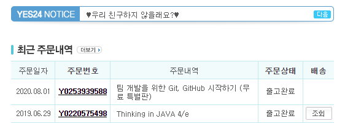
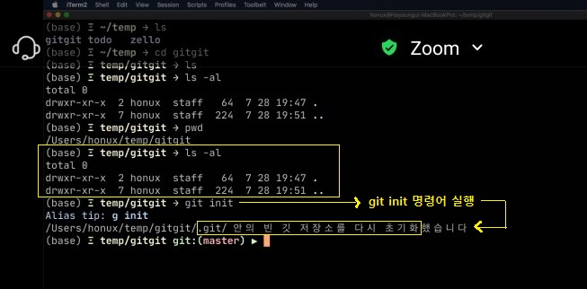
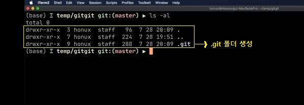

Git
=====
* 페이스북그룹인 실무코딩그룹 [온라인 실무코딩 컨퍼런스](https://www.notion.so/2020-2-fb29dc9b9531483b955c07b084f1b66c)에서 들은 내용을 기록
* 주제: 정호영님의 재미로 알아보는 Git의 내부구조
* 일시: 2020.07.28
- - -
## 목차
1. [개요](#개요)
2. [git init](#git-init)
3. [git add](#git-add)
4. [git commit](#git-commit)
5. [git unstage](#git-unstage)

## 개요
> Git에서 파일을 스테이지에 올리고 커밋을 하나 만들면 내부적으로 어떤 일이 일어나는지 살펴보려고 합니다. 개인적으로 굉장히 흥미로왔던 내용이라 다 함께 공유하고 싶습니다.

아래는 강연 시작 전 올라온 테스트(O/X)의 일부다.

1. 현재 디렉토리에서 `Git init`을 수행하면 현재 디렉토리가 로컬 저장소가 된다?
2. `Git log`로 볼 수 있는 커밋 히스토리의 정보는 어디에 저장되나?
	- [ ] 별도의 파일이나 객체로 저장
	- [ ] 커밋에 포함되어 있음
	- [ ] 브랜치 정보에 저장
3. Git의 객체는?
	- [ ] blob
	- [ ] commit
	- [ ] tree
	- [ ] tag
	- [ ] branch
4. `a.txt`를 만들고 b 디렉토리에 복사한 후 add, commit한 후 새로운 브랜치를 만들어서 체크아웃했다. 파일 객체(blob)은 총 몇 개가 생기는가?
	- [ ] 0
	- [ ] 1
	- [ ] 2
	- [ ] 3
	- [ ] 4
5. 다음 중 `git checkout` 브랜치 명령으로 값이 변하는 것은?
	- [ ] HEAD
	- [ ] 작업 디렉터리
	- [ ] 스테이지
	- [ ] blob
	- [ ] 원격 저장소
6. `Git pull`에 대해서도 생각해봅시다

- - -
다음은 강연자 분의 책 및 강의 정보.

* 책
	1. [팀 개발을 위한 Git, GitHub 시작하기(무료 특별판)](http://www.yes24.com/Product/Goods/86031178): 소스코드 버전 관리를 위한 깃·깃허브, 오픈소스 참여
* 강의
	1. [git과 github](https://www.inflearn.com/course/git-and-github#)

무료이길래 바로 구매했다.

 
	
##### [목차로 이동](#목차)

## git init
> 현재 디렉토리에서 `Git init`을 수행하면 현재 디렉토리가 로컬 저장소가 된다?

답은 X다. 아래 두 가지를 구분할 필요가 있다.

1. 작업 폴더
2. Local directory

작업 폴더, 즉 working tree는 개발자 입장에서의 작업 공간이다. git의 입장에서 이는 일종의 샌드박스(참고: [보안](https://namu.wiki/w/%EC%83%8C%EB%93%9C%EB%B0%95%EC%8A%A4#s-5))다. 그렇다면 git 입장에서의 local directory는 어디일까? 이는 `.git` 폴더다. 따라서 압축된 `.git` 파일을 풀면 `git init` 명령어와 같은 효과를 낼 수 있다. 곧 다루겠지만 local directory는 stage 준비 공간이다.

 

 

##### [목차로 이동](#목차)

## git add

##### [목차로 이동](#목차)

## git commit

##### [목차로 이동](#목차)

## git unstage

##### [목차로 이동](#목차)
